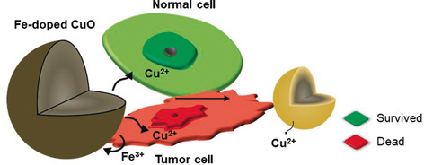

# dmcuo
A pharmacokinetic model dissolution Model for iron-doped copper oxide nanoparticles (CuO NPs). This repository contains the software accompanying the paper ["Model‐Based Nanoengineered Pharmacokinetics of Iron‐Doped Copper Oxide Applicable to Nanomedicine", November 2019, Angewandte Chemie International Edition 59(5) DOI: 10.1002/anie.201912312](https://onlinelibrary.wiley.com/doi/full/10.1002/anie.201912312)
License CC BY 4.0

# Tutorial

The workflow used to find the model parameters from experimental data and simulate the results is demonstrated in the [tutorial notebook](./Tutorial.ipynb). Please feel free to contact the current maintainer if you need any help using the library to compute parameters on new experimental data.
 

